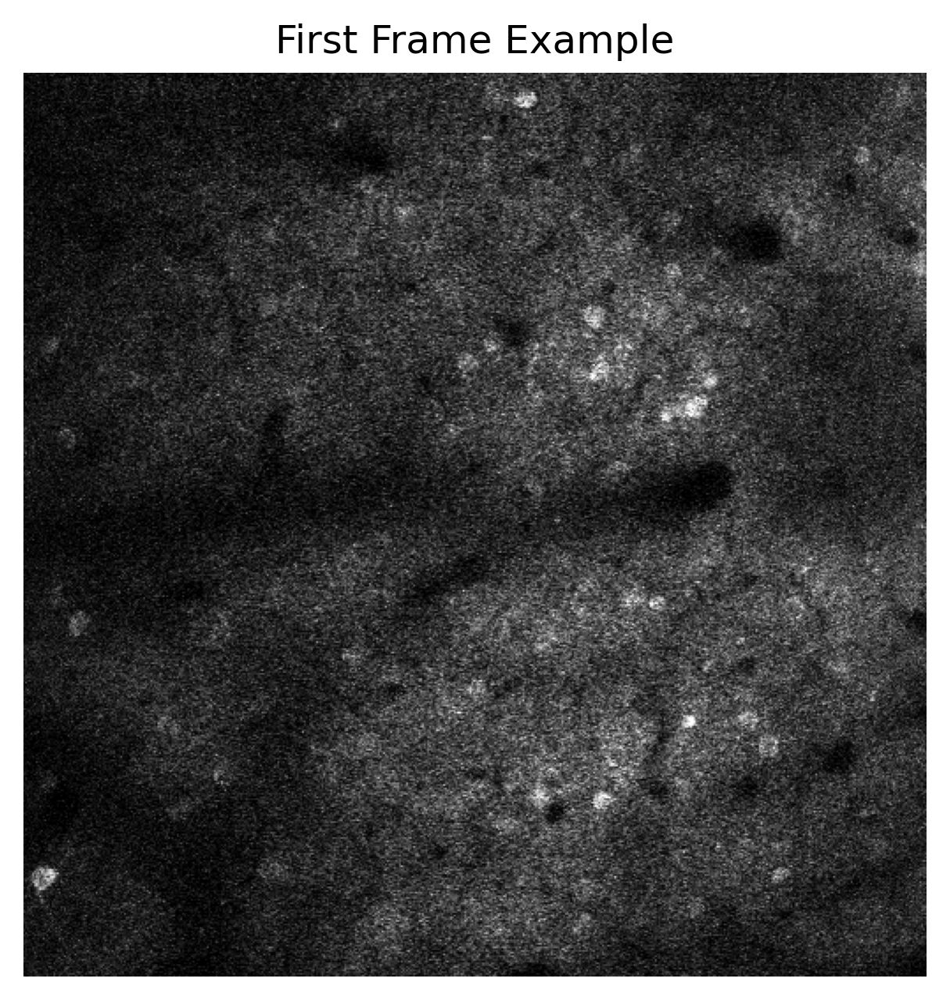
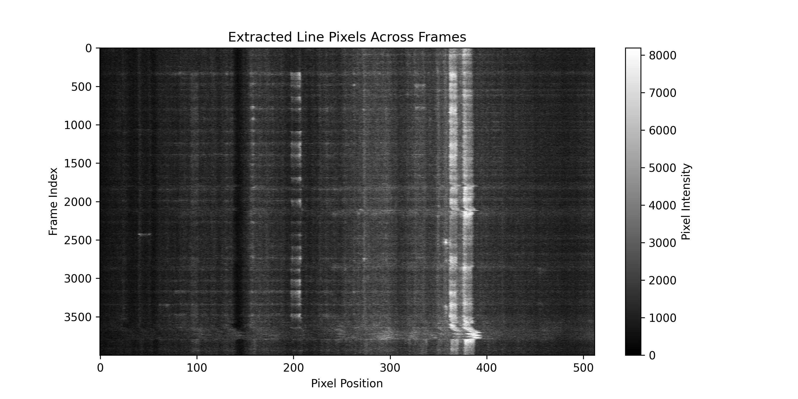

# Calcium-Imaging-Evaluation
An quick approach to evaluate your calcium imaging result

By extracting and visualizing the pixel intensity values from lines across all frames, we are able to evaluate the video quality by looking at an image.

## Example:
An example single frame from a calcium imaging video:

<p align="center">
  
</p>


Extracting a single line across frames allows for easy observation of temporal variations in the video, such as drift, contrast changes, neuron firing, and overall image quality:

<p align="center">
  
</p>

## How To Use

1. **Edit the file path:** Download `eval.py` and replace `[YourFileName]` in it with the path to your own file.  
2. **Run the script:** Execute the following command in your terminal:  

   ```bash
   python eval.py
   ``` 

